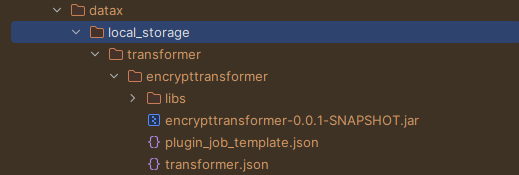
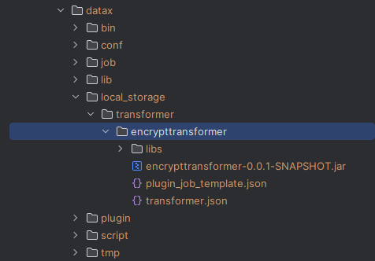

### DataX插件

SM4国密加密插件Transformer

#### 开发环境
DataX 3.0 Release datax_v202309 https://github.com/alibaba/DataX/releases/tag/datax_v202309
maven 3.8.8
jdk 1.8

#### 打包
```shell
mvn clean package -DskipTests assmebly:assembly
```

#### 使用
复制打包好的文件夹datax/local_storage


粘贴文件夹local_storage到datax文件夹下

